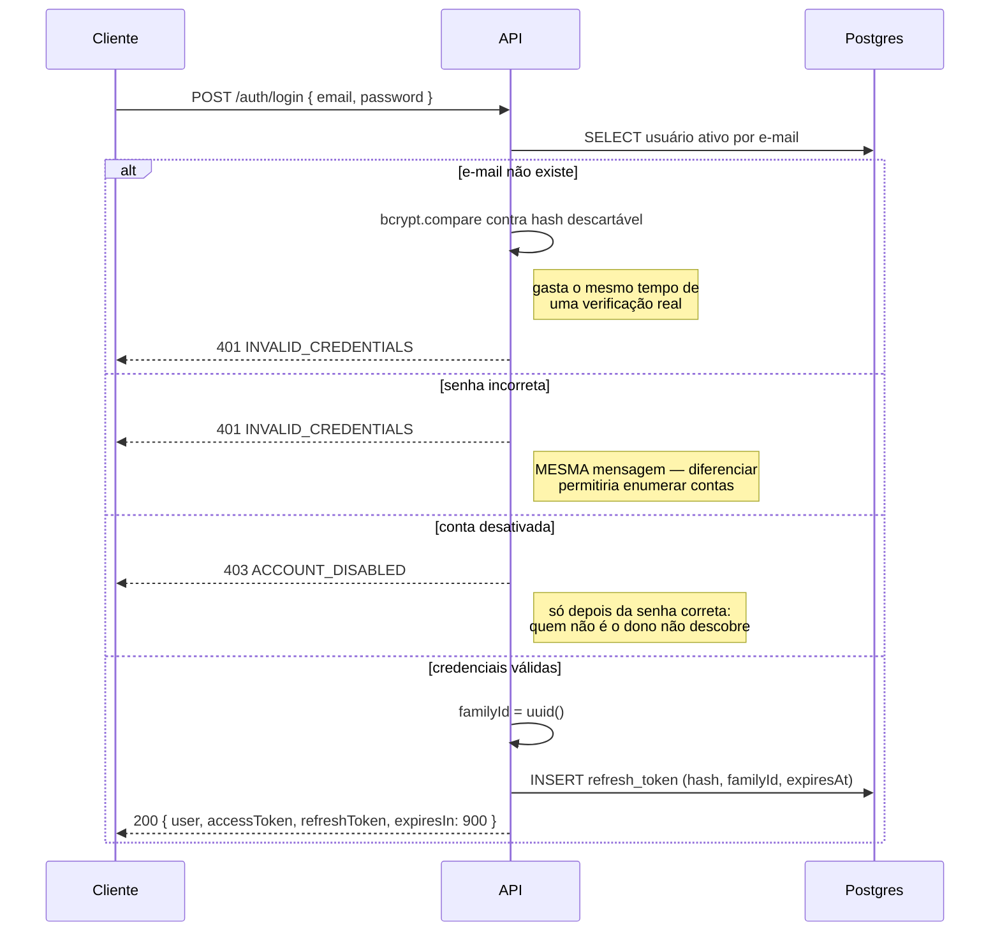
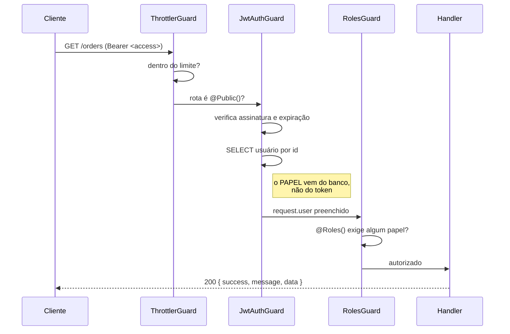
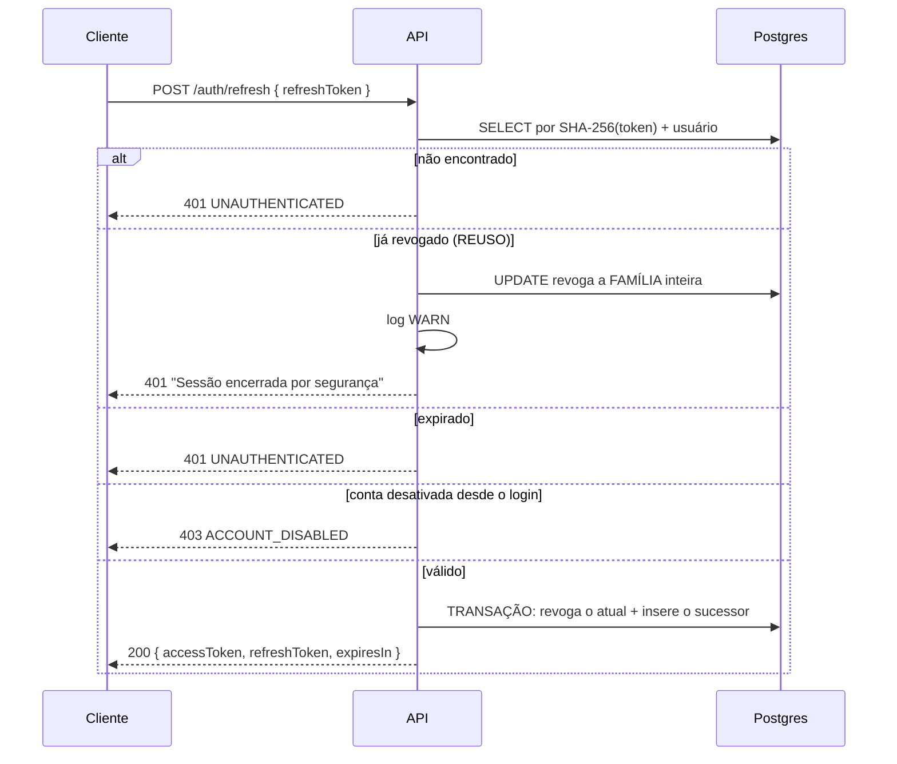

# Fluxo de autenticação — TechStore API

Decisões e trade-offs em [api-architecture.md](api-architecture.md), ADR-025 e ADR-032.
Este documento descreve **como funciona na prática**.

---

## Por que dois tokens

JWT é *stateless*: um token assinado vale até expirar e o servidor não consegue invalidá-lo.
Isso torna um `POST /logout` que apenas responde 200 uma ficção — quem copiou o token
continua autenticado.

A resposta é separar as responsabilidades:

| | Access token | Refresh token |
| --- | --- | --- |
| Formato | JWT assinado (HS256) | 32 bytes aleatórios, **opaco** |
| Validade | 15 minutos | 7 dias |
| Onde vive | memória do cliente | armazenamento do cliente |
| Verificação | assinatura + consulta ao usuário | **consulta ao banco** |
| Revogável | não | **sim** |
| No banco | não existe | guardado como hash SHA-256 |

O access token é curto porque não dá para revogá-lo; o refresh é revogável porque o banco
é a fonte da verdade sobre a sessão estar viva.

---

## Login

Três detalhes que não são acidentais:

1. **A mesma mensagem** para e-mail inexistente e senha errada.
2. **O mesmo tempo de resposta** nos dois casos — sem o `bcrypt.compare` contra um hash
   descartável, "e-mail inexistente" responderia em ~1 ms e "senha errada" em ~250 ms, e a
   diferença é medível de fora.
3. **A conta desativada é verificada depois da senha.** Invertido, qualquer pessoa
   descobriria contas suspensas sem conhecê-las.

---

## Requisição autenticada

A ordem dos guards é significativa e está declarada em `app.module.ts`:

- **Throttler primeiro** — força bruta não pode custar uma consulta ao banco por tentativa.
- **Jwt no meio** — preenche `request.user`.
- **Roles por último** — depende do passo anterior; invertido, veria `undefined` e recusaria
  todo mundo.

A consulta ao banco a cada requisição é uma escolha, não descuido: sem ela, desativar uma
conta ou rebaixar um administrador só teria efeito quando o token expirasse — até 15
minutos de acesso com o papel antigo.

---

## Renovação e detecção de roubo

Cada uso do refresh token o **queima** e emite um sucessor na mesma família.

**Por que revogar a família inteira no reuso.** Um token já rotacionado que reaparece não
acontece em uso normal — o cliente legítimo descarta o antigo ao receber o novo. Só há duas
explicações: o token vazou e o atacante está usando, ou vazou e o legítimo está usando
enquanto o atacante já rotacionou. Não há como distinguir. Derrubar a linhagem interrompe
uma sessão legítima no pior caso; a alternativa é manter uma sessão roubada viva.

**Por que a rotação é atômica.** Revogar e inserir em escritas separadas deixaria, numa
queda no meio, dois tokens vivos na mesma família — exatamente o padrão que a detecção
interpreta como roubo.

---

## Logout

Revoga a **família inteira**, não apenas o token apresentado: sair significa encerrar a
sessão, e o token apresentado é só o elo mais recente da linhagem.

Se o token não existir, a resposta é a mesma. Responder "este token não existe"
transformaria o logout em um oráculo para descobrir quais tokens são válidos.

---

## Escolhas de armazenamento

**SHA-256 e não bcrypt para o refresh token.** bcrypt é lento por design para resistir a
dicionário sobre senhas humanas, que têm pouca entropia. 256 bits aleatórios não têm
dicionário que os alcance — a lentidão não compra nada. E o salt novo a cada chamada
tornaria impossível *buscar pelo hash*: seria varrer a tabela linha a linha em toda
renovação.

**O refresh token viaja no corpo, não em cookie httpOnly.** Cookie seria mais seguro contra
XSS. A escolha foi pelo corpo porque a SPA está em outro domínio e a suíte de testes de API
manipula tokens explicitamente. A mitigação é o desenho inteiro — TTL curto, rotação,
revogação de família — e migrar é uma mudança contida ao controller.

---

## Códigos que o cliente precisa tratar

| Código | Status | O que o cliente deve fazer |
| --- | --- | --- |
| `UNAUTHENTICATED` | 401 | Renovar com o refresh; se falhar, mandar para o login |
| `INVALID_CREDENTIALS` | 401 | Exibir erro no formulário. **Não** tentar renovar |
| `ACCOUNT_DISABLED` | 403 | Mensagem de suporte. Renovar não resolve |
| `FORBIDDEN` | 403 | Esconder a ação. Renovar não resolve |

A distinção entre 401 e 403 é a confusão mais comum em API REST: **401 = não sei quem você
é** (renovar pode resolver); **403 = sei, e você não pode** (renovar entra em laço
infinito).

---

## Para a suíte de automação

| Cenário | Como reproduzir |
| --- | --- |
| Login válido | `qa@techstore.com` / `Test@1234` |
| Conta desativada | `inativo@techstore.com` / `Test@1234` → 403 |
| Rota administrativa | `admin@techstore.com` / `Admin@1234` |
| Sem permissão | logar como cliente e chamar `POST /products` → 403 |
| Sessão inválida | qualquer string como `refreshToken` → 401 |
| **Detecção de reuso** | renovar duas vezes com o MESMO refresh → 401 e família revogada |
| Token expirado | subir a API com `JWT_ACCESS_TTL_SECONDS=60` e aguardar |

Depois de `POST /test/reset`: o **access token continua válido** (os ids do seed são fixos,
`usr-001` volta a existir), mas o **refresh token é invalidado** (a tabela é truncada).
