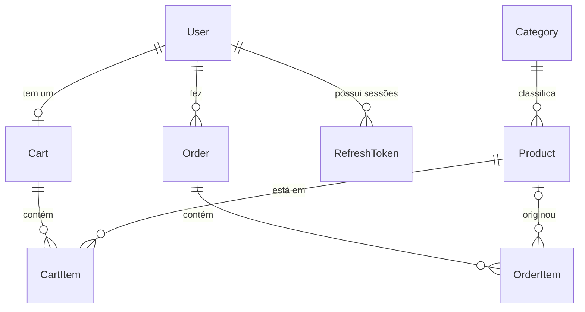

# Banco de dados — TechStore API

PostgreSQL 16, modelado com Prisma. Schema em
[`api/prisma/schema.prisma`](../api/prisma/schema.prisma); as decisões estruturais estão em
[api-architecture.md](api-architecture.md) (ADR-026 e ADR-028).

---

## Diagrama



---

## Tabelas

| Tabela | Papel | Natureza |
| --- | --- | --- |
| `users` | Identidade e credencial | Mutável |
| `refresh_tokens` | Sessões revogáveis | Efêmera |
| `categories` | Classificação do catálogo | Mutável |
| `products` | Catálogo | Mutável |
| `carts` / `cart_items` | Intenção de compra | **Rascunho** |
| `orders` / `order_items` | Compra realizada | **Imutável** |

Essa última coluna é a chave para entender o resto do modelo. Carrinho e pedido parecem a
mesma coisa — uma lista de produtos com quantidades — e são governados por regras opostas.

---

## Relacionamentos

| Relação | Cardinalidade | `onDelete` | Por quê |
| --- | --- | --- | --- |
| `User` → `Cart` | 1:0..1 | `Cascade` | Carrinho é rascunho: some com o dono |
| `User` → `Order` | 1:N | **`Restrict`** | Pedido é fato financeiro: apagar o usuário não pode apagar o histórico |
| `User` → `RefreshToken` | 1:N | `Cascade` | Sessão não sobrevive ao usuário |
| `Category` → `Product` | 1:N | **`Restrict`** | Apagar categoria não pode deixar produto órfão |
| `Cart` → `CartItem` | 1:N | `Cascade` | Composição pura |
| `Product` → `CartItem` | 1:N | `Cascade` | Produto removido sai dos carrinhos ativos |
| `Order` → `OrderItem` | 1:N | `Cascade` | Composição pura |
| `Product` → `OrderItem` | 1:N | **`SetNull`** | O item **sobrevive** ao produto; o snapshot mantém o pedido legível |

### A consequência prática do `Restrict` em `User` → `Order`

`DELETE /users/me` **não** apaga a linha. Marca `deleted_at` e `is_active = false`. Um
`DELETE` real falharia com violação de chave estrangeira assim que o usuário tivesse um
pedido — e "funcionaria" para quem nunca comprou, produzindo um endpoint que se comporta
de forma diferente dependendo do histórico. Exclusão lógica é uniforme e preserva a
contabilidade.

---

## Três decisões de modelagem

### 1. Snapshot no pedido, referência no carrinho

`cart_items` guarda `product_id` e lê o preço atual. `order_items` guarda cópia de nome,
slug e preço unitário.

O carrinho é uma **projeção viva**: mudou o preço no catálogo, o usuário vê o novo antes de
fechar a compra. O pedido é um **fato consumado**: o que foi cobrado é o que está escrito.
Sem o snapshot, reajustar um preço em 2027 reescreveria silenciosamente o histórico de
2026 — problema contábil que só aparece numa auditoria, muito depois de introduzido.

É também o motivo de `order_items.product_id` ser anulável com `SetNull`: descontinuar um
produto não pode invalidar pedidos passados.

### 2. Totais persistidos no pedido, calculados no carrinho

`orders` guarda `subtotal_in_cents`, `shipping_in_cents` e `total_in_cents`. O carrinho não
guarda total nenhum — ele é derivado dos itens a cada leitura.

Mesma lógica: recalcular o total de um pedido antigo com a regra de frete de hoje daria um
número diferente do que o cliente pagou. Já um total guardado no carrinho seria uma segunda
fonte de verdade que pode divergir dos itens — o bug clássico de carrinho, e a razão pela
qual o frontend também os calcula (`types/cart.ts`).

`order_items.line_total_in_cents` é redundante em relação a `unit_price × quantity`, e
persistido de propósito: é o valor que **foi somado** no total.

### 3. Dinheiro em `Int`, nota em `Float`

`price_in_cents INTEGER`. `rating DOUBLE PRECISION`.

Não é inconsistência. `0.1 + 0.2 = 0.30000000000000004` em ponto flutuante, e num carrinho
isso vira total errado por centavos. Nota média é valor aproximado exibido com uma casa
decimal, onde erro na décima quinta casa não tem consequência alguma.

`Decimal` seria a alternativa "correta" para dinheiro, e foi descartada por um motivo de
contrato: o Prisma devolve `Decimal.js`, que serializa como **string** em JSON — o frontend
e os testes já consomem `price` como número.

---

## Restrições que carregam regra de negócio

Regra de negócio no banco não é redundância — é o único lugar onde concorrência não passa.

| Restrição | Regra que protege |
| --- | --- |
| `carts.user_id UNIQUE` | Um carrinho ativo por usuário. Sem ela, dois "adicionar item" simultâneos criariam dois carrinhos |
| `cart_items (cart_id, product_id) UNIQUE` | Adicionar o mesmo produto duas vezes **soma** quantidade em vez de criar segunda linha. Permite `upsert` atômico |
| `users.email UNIQUE` | Uma conta por e-mail. Validar só no service perde a corrida entre dois cadastros simultâneos |
| `products.slug UNIQUE` | Slug é chave de URL |
| `refresh_tokens.token_hash UNIQUE` | Detecção de reuso de token |

O padrão: **a validação no service dá a mensagem de erro boa; a restrição no banco dá a
garantia.** As duas existem, e a do banco é a que vale sob concorrência.

---

## Índices

| Índice | Consulta que atende |
| --- | --- |
| `products (is_active, category_id)` | Listagem filtrada — o caso mais frequente |
| `products (price_in_cents)` | Ordenação por preço |
| `products (category_id)` | Join com categoria |
| `orders (user_id, placed_at DESC)` | "Meus pedidos, mais recentes primeiro" |
| `users (deleted_at)` | Toda listagem filtra por não-excluído |
| `refresh_tokens (family_id)` | Revogação de família inteira ao detectar reuso |

---

## Busca textual

`products.search_index` guarda `nome + marca + categoria + descrição` **normalizado**
(minúsculo, sem acento), gravado na escrita.

Reproduz exatamente a semântica que o frontend já tem e a suíte já assevera: `"audio"`
encontra `"Áudio"`, e todos os termos precisam aparecer, em qualquer ordem
(`"vertex notebook"` = `"notebook vertex"`).

| Alternativa | Por que não |
| --- | --- |
| Extensão `unaccent` | Exige superusuário — indisponível em boa parte dos bancos gerenciados |
| `ILIKE` sobre as colunas originais | Não resolve acento: `"audio"` não encontraria `"Áudio"` |
| `tsvector` + GIN | É a resposta certa em escala. Com 12 produtos, complexidade sem ganho mensurável |

Calcular o índice na leitura obrigaria a varrer e normalizar a tabela inteira a cada
consulta. Derivar na escrita custa uma linha no seed e no service.

---

## Seed — infraestrutura de teste, não dado de mentira

[`api/prisma/seed.ts`](../api/prisma/seed.ts) reproduz o contrato já declarado em
`frontend/src/data/` e `automation/data/`. Ids fixos, senhas conhecidas, preços exatos.

**4 usuários** — os três do frontend, mais um administrador (as rotas de escrita de produto
precisam de alguém que possa exercitá-las):

| E-mail | Senha | Cenário |
| --- | --- | --- |
| `qa@techstore.com` | `Test@1234` | Usuário padrão da suíte |
| `ana.souza@techstore.com` | `Ana@2024` | Segundo usuário — isolamento de carrinho |
| `inativo@techstore.com` | `Test@1234` | Credencial correta, conta desativada (403) |
| `admin@techstore.com` | `Admin@1234` | Rotas administrativas |

**6 categorias** e **12 produtos**, verificados contra `automation/data/products.ts`:
catálogo de 12, 2 por categoria, `prd-008` mais barato, `prd-004` mais caro, `prd-006` e
`prd-010` esgotados, e os cinco termos de busca com a contagem esperada.

O seed é **idempotente** (`upsert` em tudo): rodar duas vezes produz o mesmo estado. O hash
da senha fica fora do `update` — bcrypt gera salt novo a cada chamada, então reescrevê-lo a
cada execução seria escrita inútil e um hash diferente a cada rodada.

```bash
npm run db:seed    # aplica o seed
npm run db:reset   # recria o schema do zero e semeia (estado limpo entre suítes)
```

---

## Migrations

```bash
npm run prisma:migrate   # desenvolvimento: cria a migration a partir do schema
npm run prisma:deploy    # produção/CI: aplica migrations pendentes, nunca gera
```

`migrate dev` compara schema e banco e pode **reescrever** o banco; `migrate deploy` apenas
aplica o que já está versionado. Usar `dev` em produção é como usar `git push --force` na
main.

A migration inicial (`20260805210000_init`) foi gerada com `prisma migrate diff` a partir
do schema — determinística e revisável como SQL antes de tocar em qualquer banco.
